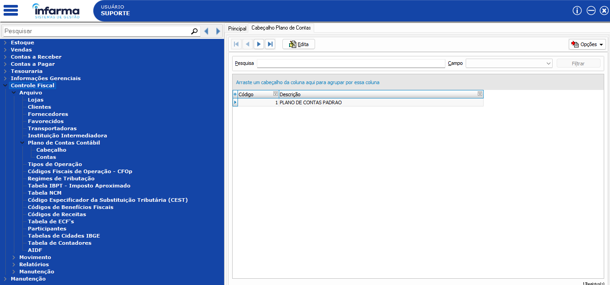
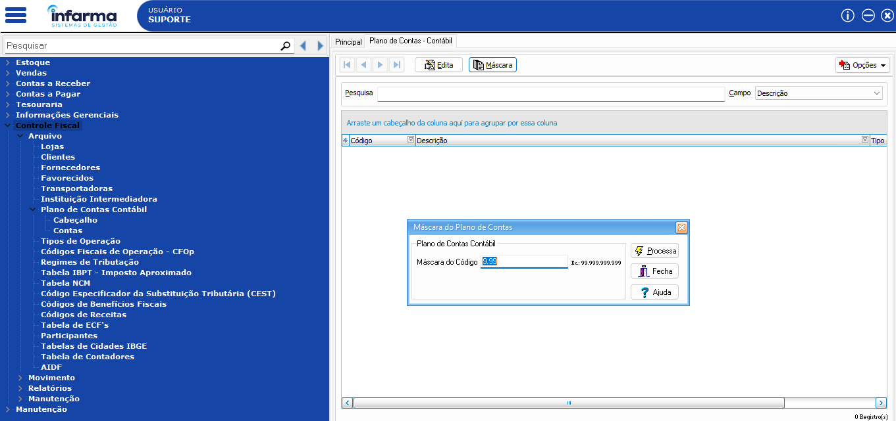
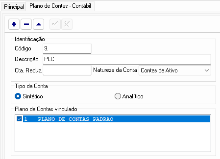
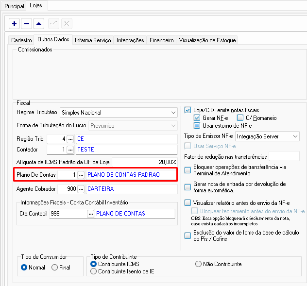
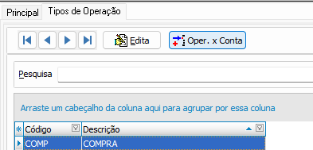
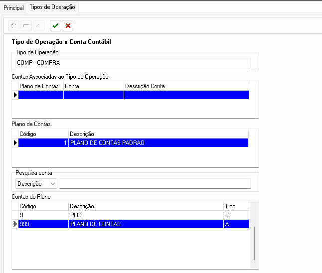

# 📚 Plano de Contas Contábil


## Como criar o plano de contas contábil, vincular aos tipos de operações e ao cadastro de lojas.


## Criando as contas padrões!
1. Acesse em: Controle Fiscal > Arquivo > Plano de Contas Contábil > Cabeçalho: 
Clique em EDITA e verifique se existe algum registro; 
Se existir, basta pular para o próximo passo! 

Se não existir, clique em EDITA e preencha com a descrição: "PLANO DE CONTAS PADRAO" e salve a inclusão devendo ficar desta forma:



2. Acesse em Controle Fiscal > Arquivo > Plano de Contas Contábil > Contas: clique em MÁSCARA e preencha a máscara do código com 9.99 e clique no botão PROCESSA



3. Após a definição do código da máscara, clique em EDITA e clique para incluir as contas contábeis.
Primeiro crie a conta chamada PLC devendo o cadastro da seguinte forma abaixo:



Após preencher os dados da primeira conta, clique para salvar e crie uma nova conta chamada PLANO DE CONTAS e defina da seguinte maneira:


**⚠️ Não esqueça de marcar na conta PLC, o tipo de conta como Sintético e na conta PLANO DE CONTAS o tipo como analítico⚠️**

## Vinculando ao cadastro de lojas!
Acesse em Controle Fiscal > Arquivo > Lojas > EDITA > Outros dados e vincule o Plano de contas padrão ao cadastro da loja, como mostra a imagem abaixo:



## Vinculando as contas aos tipos de operações!

Acesse em Controle Fiscal > Arquivo > Tipo de Operação e clique sob o primeiro tipo de operação uma vez, deixando ele em azul e clique no botão Oper x Conta. 



Clique no botão de inclusão e selecione a conta "PLANO DE CONTAS" do tipo Analítico:



Clique para salvar e após a finalização do primeiro Tipo de operação, o mesmo processo deve ser feito para todos os restantes!

> ⚠️ **Observação:** Esse processo pode ser feito tanto no central (em caso de rede) quanto no varejo (para loja independente). 

Para maior otimização no tempo, pode ser utilizado o seguinte script abaixo para realizar todo esse processo descrito acima:

```bash
USE VMD;

GO

UPDATE PARAM SET MasCmpCodPlc = '9.99'

GO

DECLARE @DataAtual DATETIME;
SET @DataAtual = GETDATE();

EXEC sp_executesql N'INSERT INTO PCCTB
  (Cod_PlcCtb, Des_PlcCtb, Tip_PlcCtb, Dat_Cadast, Cod_NatCta, Cod_PlaCtb)
VALUES
  (@P1, @P2, @P3, @P4, @P5, @P6)',
N'@P1 varchar(1),@P2 varchar(3),@P3 varchar(1),@P4 datetime,@P5 int,@P6 int','9','PLC','S',@DataAtual,0,1;

GO

exec sp_executesql N'Select * from PCCTB Where Cod_PlcCtb = @P1  and Cod_IdePcc =  @P2',N'@P1 nvarchar(1),@P2 nvarchar(1)',N'9',N''

GO

INSERT INTO PLXPC (Cod_Plxpcc, Cod_Plactb, Cod_Plccid) VALUES ( 0,1,1)

GO

DECLARE @DataAtual DATETIME;
SET @DataAtual = GETDATE();

exec sp_executesql N'insert into "PCCTB"
  ("Cod_PlcCtb", "Des_PlcCtb", "Tip_PlcCtb", "Dat_Cadast", "Cod_NatCta", "Cod_PlaCtb")
values
  (@P1, @P2, @P3, @P4, @P5, @P6)',N'@P1 varchar(3),@P2 varchar(15),@P3 varchar(1),@P4 datetime,@P5 int,@P6 int','999','PLANO DE CONTAS','A',@DataAtual,0,1
  
 GO 
 
 exec sp_executesql N'Select * from PCCTB Where Cod_PlcCtb = @P1  and Cod_IdePcc =  @P2',N'@P1 nvarchar(3),@P2 nvarchar(1)',N'999',N''
 
 GO
 
 INSERT INTO PLXPC (Cod_Plxpcc, Cod_Plactb, Cod_Plccid) VALUES ( 1,1,2)

 GO

DECLARE @Cod_TipOpe varchar(4)
 
DECLARE CursorOperacoes CURSOR FOR
SELECT Cod_TipOpe FROM TPOPE
 
OPEN CursorOperacoes
 
FETCH NEXT FROM CursorOperacoes INTO @Cod_TipOpe
 
WHILE @@FETCH_STATUS = 0
BEGIN
    EXEC sp_executesql N'INSERT INTO OPXPL (Cod_TipOpe, Cod_IdePCC, Cod_PlaCtb) VALUES (@P1, @P2, @P3)',
        N'@P1 varchar(4), @P2 int, @P3 int',
        @P1 = @Cod_TipOpe,
        @P2 = 2,
        @P3 = 1
 
    FETCH NEXT FROM CursorOperacoes INTO @Cod_TipOpe
END
 
CLOSE CursorOperacoes
DEALLOCATE CursorOperacoes