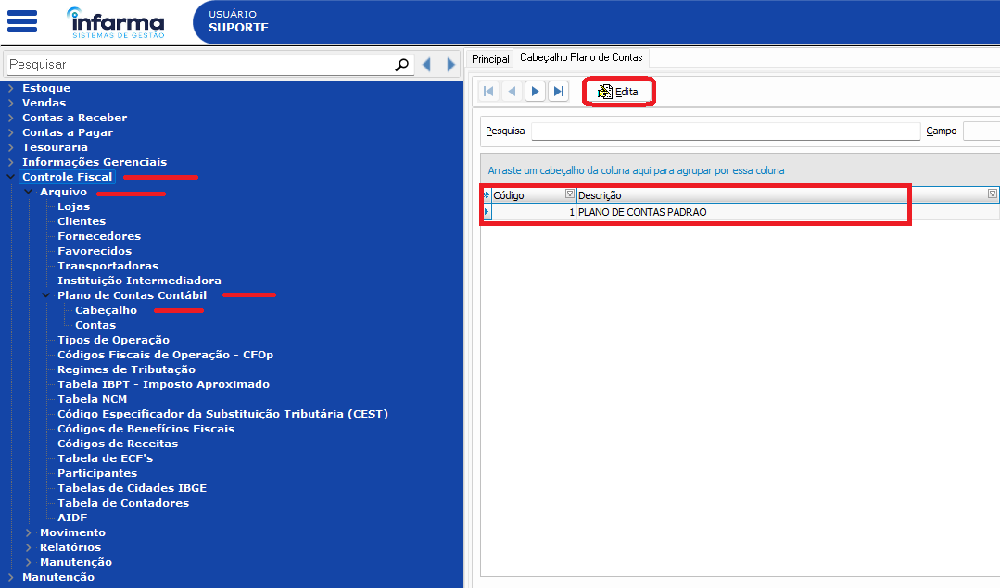

# Plano de Contas Contábil

## Como criar o plano de contas contábil, vincular aos tipos de operações e ao cadastro de lojas.

> ⚠️ **Observação:** Esse processo pode ser feito tanto no central (para rede de lojas) quando no varejo (para lojas independentes). Se o cliente for parte de rede, o processo deve ser feito no central!


## Verificando se existe o Plano de Contas Padrão!
1. Acesse em: Controle Fiscal > Arquivo > Plano de Contas Contábil > Cabeçalho: 
Clique em EDITA e verifique se existe algum registro; Se existir, basta pular para o próximo passo; se não existir, clique em EDITA e preencha com a descrição: "PLANO DE CONTAS PADRAO" e salve a inclusão.



2. Acesse em Controle Fiscal > Arquivo > Plano de Contas Contábil > Contas e clique em MÁSCARA e preencha o campo solicitado da seguinte forma: 99.999.999.999 e clique em PROCESSA.

3. Após a definição da máscara, clique em EDITA e clique para incluir uma conta chamada PLC fazendo o cadastro da seguinte forma abaixo:


Após preencher os dados da primeira conta, clique para salvar e crie uma nova conta chamada PLANO DE CONTAS e defina da seguinte maneira:


**⚠️ Não esqueça de marcar na conta PLC, o tipo de conta como Sintético e na conta PLANO DE CONTAS o tipo como analítico⚠️**

```bash
git clone https://github.com/seu-usuario/seu-repositorio.git
cd seu-repositorio
npm install
npm start
