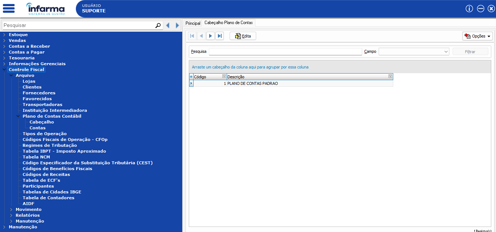
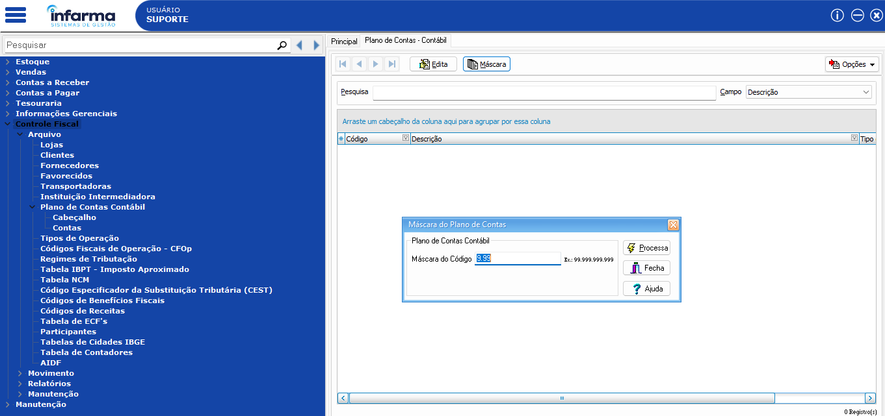
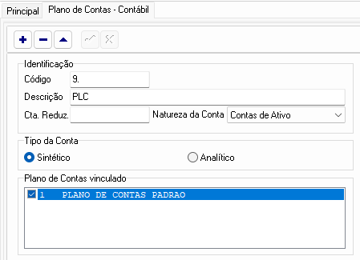
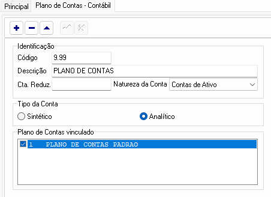
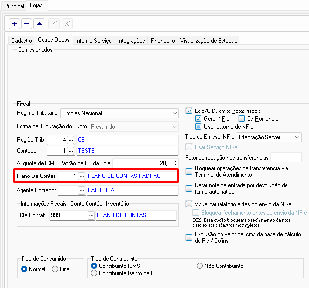

# Plano de Contas Contábil

## Como criar o plano de contas contábil, vincular aos tipos de operações e ao cadastro de lojas.


## Criando as contas padrões!
1. Acesse em: Controle Fiscal > Arquivo > Plano de Contas Contábil > Cabeçalho: 
Clique em EDITA e verifique se existe algum registro; 
Se existir, basta pular para o próximo passo! 

Se não existir, clique em EDITA e preencha com a descrição: "PLANO DE CONTAS PADRAO" e salve a inclusão devendo ficar desta forma:



2. Acesse em Controle Fiscal > Arquivo > Plano de Contas Contábil > Contas: clique em MÁSCARA e preencha a máscara do código com 9.99 e clique no botão PROCESSA



3. Após a definição do código da máscara, clique em EDITA e clique para incluir as contas contábeis.
Primeiro crie a conta chamada PLC devendo o cadastro da seguinte forma abaixo:



Após preencher os dados da primeira conta, clique para salvar e crie uma nova conta chamada PLANO DE CONTAS e defina da seguinte maneira:




**⚠️ Não esqueça de marcar na conta PLC, o tipo de conta como Sintético e na conta PLANO DE CONTAS o tipo como analítico⚠️**

## Vinculando ao cadastro de lojas!
Acesse em Estoque > Arquivo > Lojas > EDITA > Outros dados e vincule o Plano de contas padrão ao cadastro da loja, como mostra a imagem abaixo:



> ⚠️ **Observação:** Esse processo pode ser feito tanto no central (para rede de lojas) quando no varejo (para lojas independentes). Se o cliente for parte de rede, o processo deve ser feito no central!

```bash
git clone https://github.com/seu-usuario/seu-repositorio.git
cd seu-repositorio
npm install
npm start
